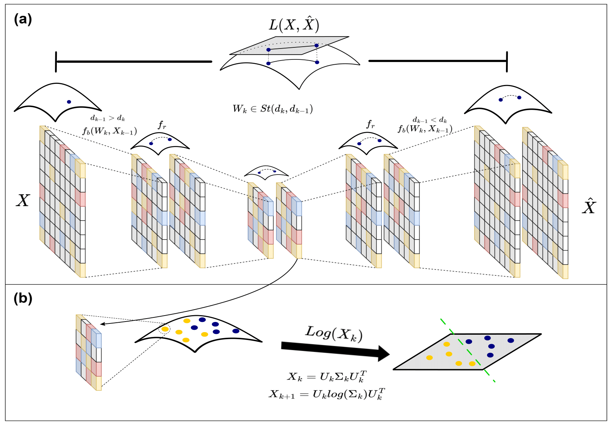

# A self-supervised deep Riemannian representation to classify parkinsonian fixational patterns

This repository is related to the paper entitle:

*"A self-supervised deep Riemannian representation to classify parkinsonian fixational patterns"* (__Under revision__).  

Edward Sandoval1, Juan Olmos 2, Fabio Martínez 1*

1  Biomedical Imaging, Vision and Learning Laboratory ([BIVL²ab](https://bivl2ab.uis.edu.co/)), Universidad Industrial de Santander (UIS), Bucaramanga 680002,Colombia.

  

 

# Data
------------

To download the associated imaging data: [Request Access to Dataset](mailto:famarcar@saber.uis.edu.co?cc=jaolmosr@correo.uis.edu.co&subject=Request%20for%20access:%20Ocular%20Fixation%20Dataset). The **Ocular Fixation Dataset** includes 13 patients diagnosed with PD and 13 Control subjects. The study incorporates PD subjects with different disease degree progression (Hoehn-Yahr rating scale). For each patient, the dataset includes five video samples (duration of five seconds each one) of the patient's eyes while perfirming an ocular fixation task. 

### Preparing data
For preparing the data follow this steps:
1. Locate the ``C-ojos`` and ``PK-ojos`` folders inside the repository's folder ``data/raw_videos``.

2. The extra data: ``coordinates_ocular_fixation.csv``, contains the spatial location where the slices were calculated. Locate this file inside the repository's folder ``data/``.

2. run the ``data/calculate_slices.py`` script to create the ``data/ocular_fixation_slices`` folder. 

The files in this folder follow the nomenclature: AAA_B_C_D.png, where AAA refers to the patient id (For example P00,P01,...,P12,C00,...,C12), B is the eye (1 for the right eye and 0 for the left), C is the video sample from which was extracted the slice (0,1,2,3,4 or 5), and D refers to the slices angle (0: slice at 0 degrees, 1: slice at 45 degrees, 2: slice at 90 degrees, and 3: slices at 135 degrees).

# Contact Information
------------
* Edward A. Sandoval: edwardsandoval.work@gmail.com
